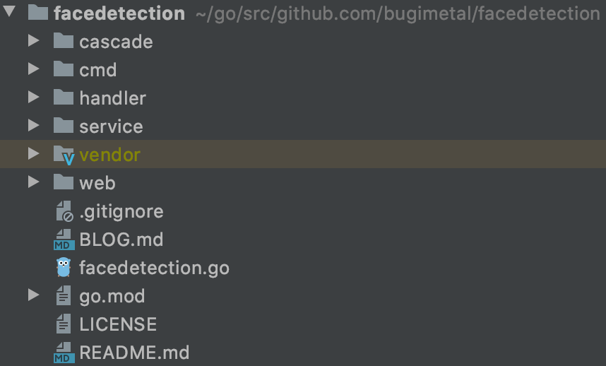
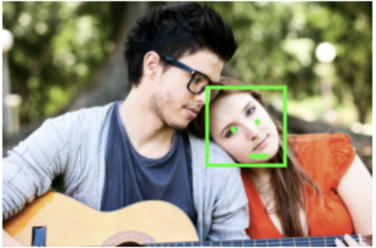

Face Detection API in golang
=====

Face Detection service has been developed with the idea to provide simple API to the end user which allows detecting face, and it's parts, like eyes and mouth.
This simple API can be used to build more advanced services like face blurring or face masks, etc.

Golang has been chosen as a language to implement this service.

## Face detection library

First thing which comes to my mind when I'm thinking about image processing and computer vision is OpenCV. 
I was already working with this library when I was playing around with C++. Golang has a package to use OpenCV 4, it can be found here: [gocv](https://github.com/hybridgroup/gocv).
Although, it requires additional software to be installed on your computer, so I've decided to take a look on other options, there are several of them:

* [go-face](https://github.com/Kagami/go-face)
* [pigo](https://github.com/esimov/pigo)
* [gocv](https://github.com/hybridgroup/gocv)

The only library which doesn't require any additional software is `pigo`. I like pure Go libraries, therefore I've decided to use this one as my main face detection library.

## Project structure

Go doesn't have official guidelines of how to structure your project, but I like to use best practices from those style guides:

* [Standard Go Project Layout](https://github.com/golang-standards/project-layout)
* [Style guideline for Go packages](https://rakyll.org/style-packages/)

This project code structure looks as following:



* `cmd/facedetection` - contains main application. 
The flow is simple, it creates the services, then it creates a handler and passes services as a dependency to it. After the handler is created, it listens for the new connections.
* `handler` - contains everything that is related to serving HTTP requests, like: router, error handling and http handlers itself.
Handler has services as a dependency, it uses them when processing the request. 
* `service` - contains services with main business logic. For this application we have two services: `ImageFetcher` and `FaceDetection`. 
First is responsible for fetching the image from the internet by url and validating if the actual content is an image. Second service is responsible for the actual face recognition. 
* `web` - contains static files for demo purposes.
* `facedetection.go` - this file contains the main structures that can be used by any part of the application. Also, the common errors that can be used by services are specified here.
* `cascade` - this directory contains classifiers that are required by the face detection library `pigo`.

## How it works

Service exposes single API endpoint which only requires image URL to provide. In the response it returns json with the list of detected faces.

Example usage:
```
curl http://localhost:8080/v1/facedetection/aHR0cHM6Ly9yYXcuZ2l0aHVidXNlcmNvbnRlbnQuY29tL2VzaW1vdi9waWdvL21hc3Rlci90ZXN0ZGF0YS9zYW1wbGUuanBn
```
Response:
```json
{
    "faces": [
        {
            "bounds": {
                "x": 573,
                "y": 79,
                "height": 52,
                "width": 52
            },
            "mouth": {
                "x": 596,
                "y": 125,
                "height": 1,
                "width": 18
            },
            "left_eye": {
                "x": 595,
                "y": 103,
                "scale": 0
            },
            "right_eye": {
                "x": 615,
                "y": 103,
                "scale": 0
            }
        }
    ]
}
```

We can use those coordinates from response and try to draw results for the given image.


To see more examples of how it works I've created a small demo with several pictures.
In order to test it, just start the application locally with `go run cmd/facedetection/main.go` and visit [Demo page](http://localhost:8080/web/demo.html)

## Face Detection is not ideal

As you see in the example above and in the demo, the detection itself is good but not ideal. It doesn't recognize some faces, or it has issues with recognizing eyes and mouth position.
The `pigo` library has some detection configuration, e.g.: detection window move or scale factor to search faces. 
I've spent some time finding the best options, but still it doesn't work for all the images perfectly, especially if we deal with the faces that are rotated.
The library provides the ability to search for rotated faces, but the result is not great, and if you initialize faces classifier with angle configuration it doesn't work great for not angled images.




## Final Thoughts

I had fun time implementing this service, although it was not easy. 
The `pigo` library is not well documented, but luckily the author has other projects that are using `pigo`, so it gives us better overview of how this library can be used.

I've chosen to use `pigo` in this service, but we're not limited with only this option. In order to improve detection quality, we may try using different image processing libraries.
Also, when the real-time detection is needed, the better option might be to use OpenCV.
